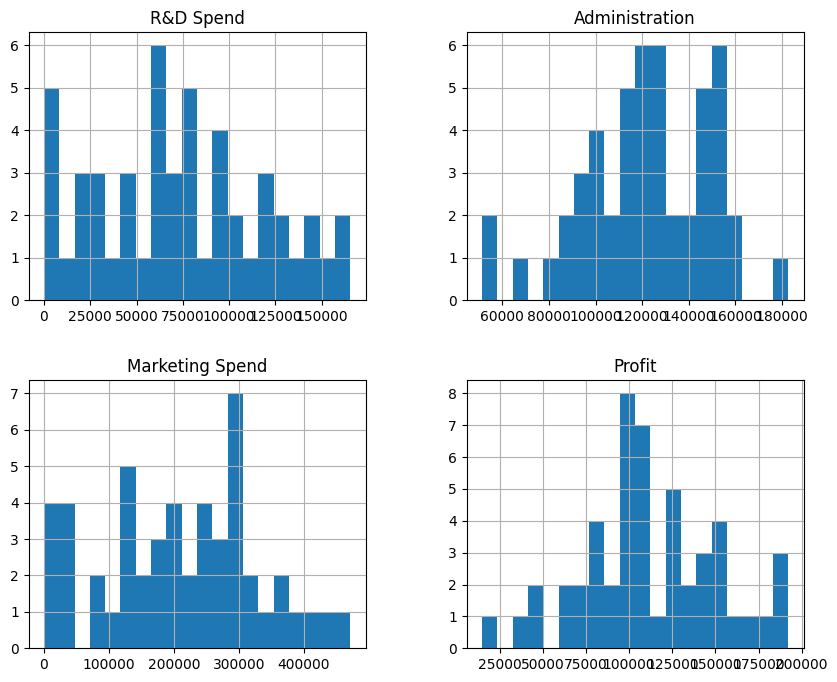
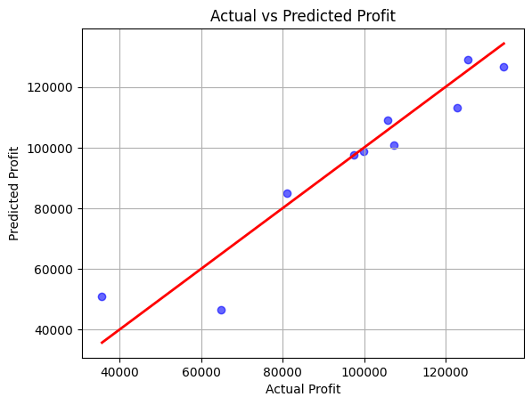

# Startup Profit Prediction using Machine Learning
A Machine Learning project that predicts the profit of a startup based on its spending patterns and location using historical data.

## Project Overview

This project uses Machine Learning (Linear Regression) to predict startup profits by analyzing:
1. R&D Spend
2. Administration Spend
3. Marketing Spend
4. Startup Location (State)
The model is trained on 50+ real startup records and achieves ~80% accuracy, helping startups plan budgets, evaluate risk, and make data-driven decisions early.

## 🛠 Tech Stack


## 🔄 Workflow

Dataset collection from Kaggle
Data cleaning & preprocessing
Exploratory Data Analysis (EDA)
Feature encoding & normalization
Model training using Linear Regression
Profit prediction via CLI

## ⚙️ How It Works

The model learns patterns from past startup data (diagnostic analysis)
Applies learned trends to new inputs (predictive analysis)
User enters spending values & state
Model instantly predicts expected profit

## 💻 Run Locally
1.
```bash
git clone https://github.com/your-username/startup-profit-prediction.git
```
2.
```bash
cd startup-profit-prediction
```
3. 
```bash
pip install pandas numpy scikit-learn matplotlib
```
4. 
```bash
jupyter notebook
```
Run all cells and update input values to get predictions.

## 📸 Output

### 📊 Data exploration visualizations


### 📈 Linear regression prediction graph



## 🧠 What I Learned
- End-to-end Data Science workflow
- Data cleaning & preprocessing
- Exploratory Data Analysis (EDA)
- Feature encoding & normalization
- Training and evaluating ML models
- Real-world application of Linear Regression

Future Scope

Deploy model
Expose predictions via API
Build a web-based interface


## 🤝 Open for Contribution

Contributions are welcome! 🎉  
If you have ideas to improve the model, optimize accuracy, add deployment, or build an API/web interface, feel free to contribute.

### How to Contribute
1. Fork the repository  
2. Create a new branch (`feature/your-feature-name`)  
3. Commit your changes  
4. Push to your fork  
5. Open a Pull Request  

All suggestions, bug reports, and improvements are appreciated 🚀


